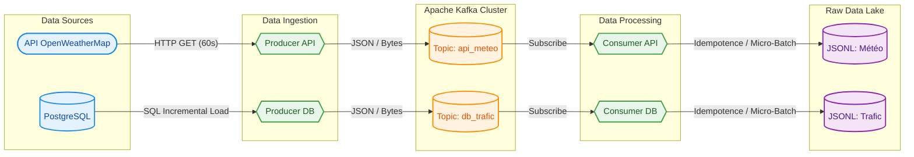

# 🚀 Real-Time Data Streaming Pipeline (Apache Kafka)

## 📌 Description du Projet
Ce projet académique démontre la mise en place d'une architecture de **Stream Processing** complète et robuste, utilisant **Apache Kafka** en mode KRaft. 

L'objectif principal est de construire un pipeline de données en temps réel capable d'ingérer, de traiter et de stocker des flux de données provenant de deux sources distinctes (une API externe et une Base de Données relationnelle), en appliquant les meilleures pratiques de l'ingénierie des données (Idempotence, Change Data Capture, Micro-Batching, sémantique Exactly-Once).

## 🏗️ Architecture Technique



## 🛠️ Stack Technologique
- **Message Broker** : Apache Kafka 3.7 (KRaft Mode)
- **Base de Données Source** : PostgreSQL 15
- **Langage** : Python 3
- **Déploiement** : Docker & Docker Compose
- **Monitoring** : Kafbat UI
- **Stockage cible** : Format JSON Lines (Data Lake)

## ⚙️ Concepts Clés Implémentés
1. **Infrastructure as Code (IaC)** : Déploiement automatisé du cluster et création idempotente des topics via *Init Containers*.
2. **Incremental Load (Polling)** : Extraction base de données basée sur un curseur (High-Water Mark) évitant les doublons à la source.
3. **Partitionnement Strict** : Utilisation des Clés Primaires comme clés de partition Kafka garantissant l'ordre chronologique de livraison.
4. **Idempotence & Exactly-Once** : Gestion d'un registre en mémoire (Set) par les consommateurs croisé avec un *Commit Différé* manuel de Kafka.
5. **Micro-Batching** : Tampon mémoire (Buffer) côté consommateur pour minimiser les I/O disques lors de l'écriture en zone Raw.

## 🚀 Guide de Démarrage

### 1. Prérequis
- Docker Desktop (ou Docker Engine via WSL2)
- Python 3.x
- Clé d'API OpenWeatherMap

### 2. Installation
Clonez le dépôt, puis configurez l'environnement virtuel :
```bash
python -m venv venv
# Windows : venv\Scripts\activate
# Linux/WSL : source venv/bin/activate
pip install -r requirements.txt
```

Créez un fichier `.env` à la racine :
```env
OPENWEATHER_API_KEY=votre_cle_api
DB_USER=postgres
DB_PASSWORD=votre_mdp
DB_HOST=localhost
DB_PORT=5432
DB_NAME=transport_meteo
KAFKA_BROKER=localhost:9092
```

### 3. Lancement de l'Infrastructure
Démarrez les conteneurs en tâche de fond :
```bash
docker compose up -d
```
*L'interface de surveillance Kafbat UI sera disponible sur `http://localhost:8080`.*

### 4. Exécution du Pipeline Temps Réel
Dans des terminaux séparés, lancez les différents micro-services :

**Flux Météo :**
```bash
python producer_api.py
python consumer_api.py
```

**Flux Trafic (PostgreSQL) :**
```bash
python producer_db.py
python consumer_db.py
```

Les données consolidées apparaîtront en temps réel dans le répertoire `/data_lake`.
